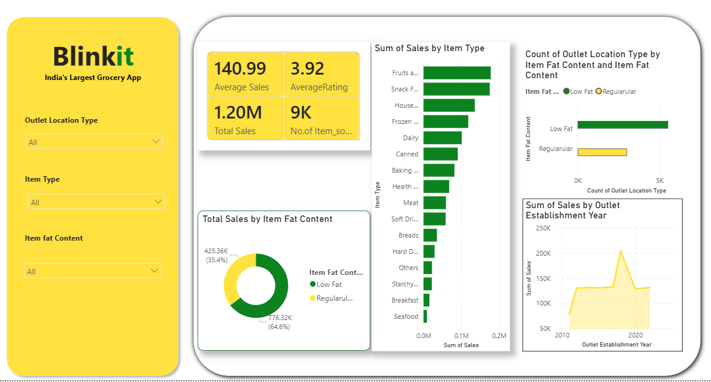
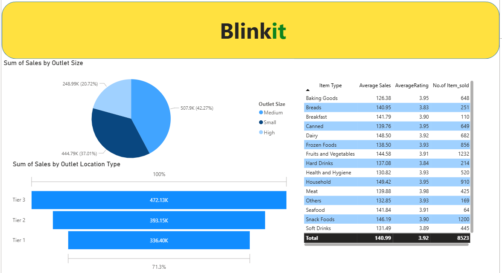

# Blinkit-Sales-Analysis
Power BI dashboard analyzing Blinkit sales performance, outlet analytics, product trends, and customer insights using DAX and data visualization.
# Blinkit Sales Analysis Dashboard
## 📌 Project Overview

An interactive Power BI dashboard built to analyze Blinkit sales data and generate business insights through data visualization and KPI tracking.
---

## 🎯 Objectives

- Analyze overall sales performance.
- Identify top-selling product categories.
- Compare outlet performance.
- Track sales trends.
- Evaluate customer ratings.

---

## 🛠 Tools Used

- Power BI
- Power Query
- DAX
- Data Modeling
- Data Visualization

---

## 📊 Key KPIs

- Total Sales
- Average Sales
- Average Rating
- Number of Items Sold

---

## 📈 Dashboard Features

### Sales Analysis
- Sales Performance Overview
- Sales Trend Analysis

### Product Analysis
- Sales by Item Type
- Sales by Fat Content

### Outlet Analysis
- Sales by Outlet Size
- Sales by Outlet Location
- Outlet Establishment Analysis

### Interactive Filters
- Item Type
- Fat Content
- Outlet Location Type

---

## 🔍 Key Insights

- Identified top-performing products.
- Compared sales across outlet locations.
- Analyzed outlet size contribution.
- Evaluated customer satisfaction through ratings.
- Tracked sales growth trends.

---

## 💡 Skills Demonstrated

- Data Cleaning
- Data Modeling
- DAX Measures
- Dashboard Development
- Business Intelligence
- Data Visualization

---

## 📸 Dashboard Preview

---

## 🏆 Project Outcome

Developed an interactive business intelligence dashboard that converts raw sales data into actionable insights for better decision-making.

---

